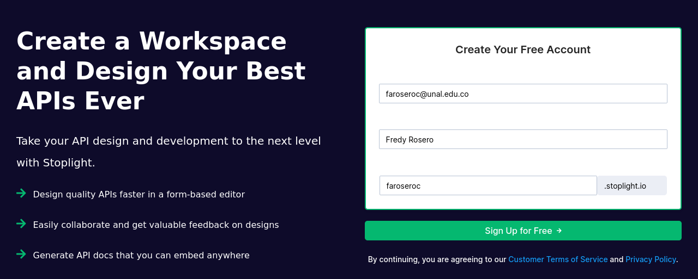
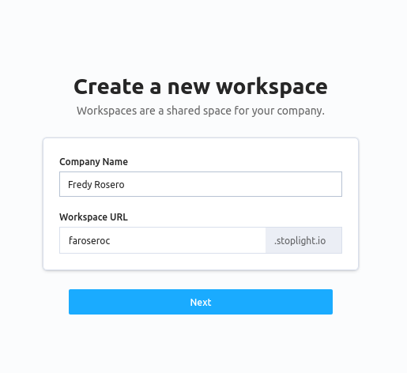
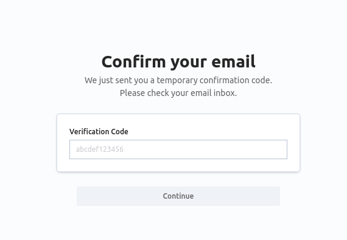
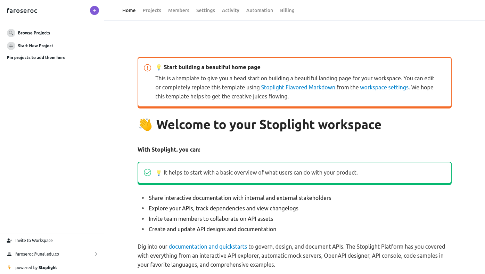
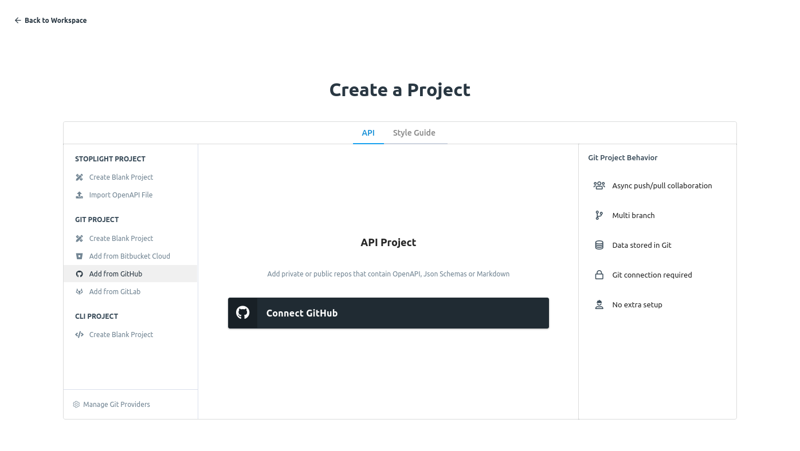
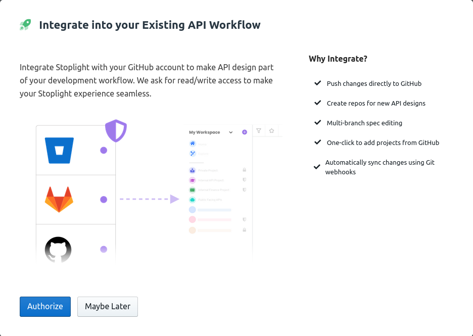
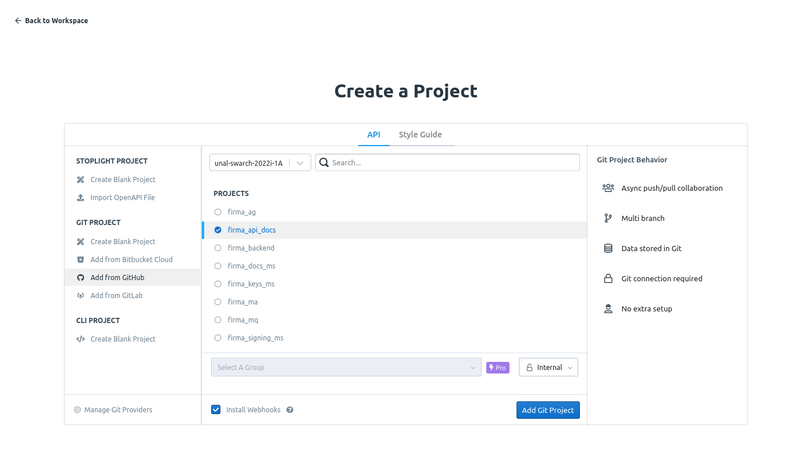
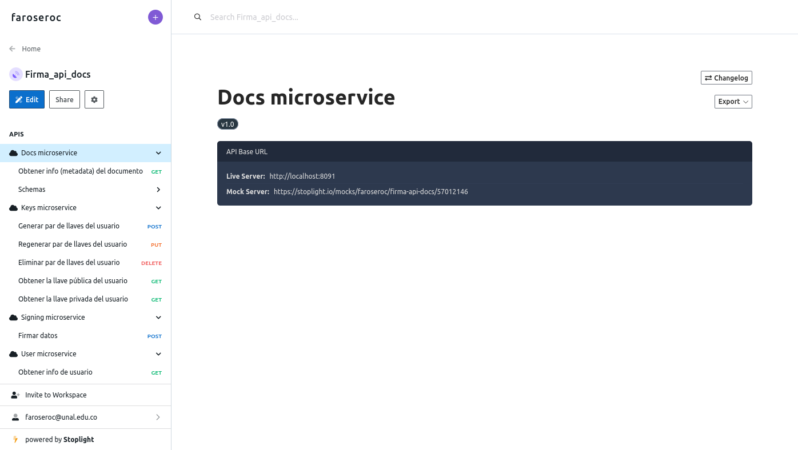
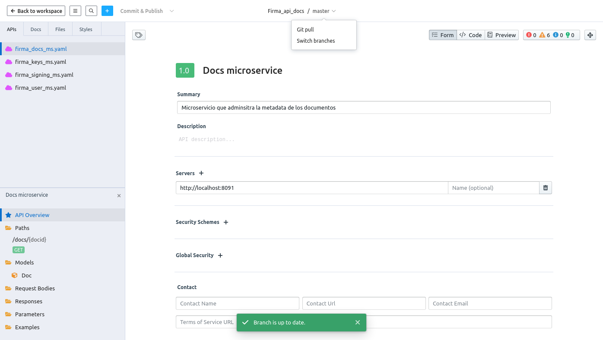
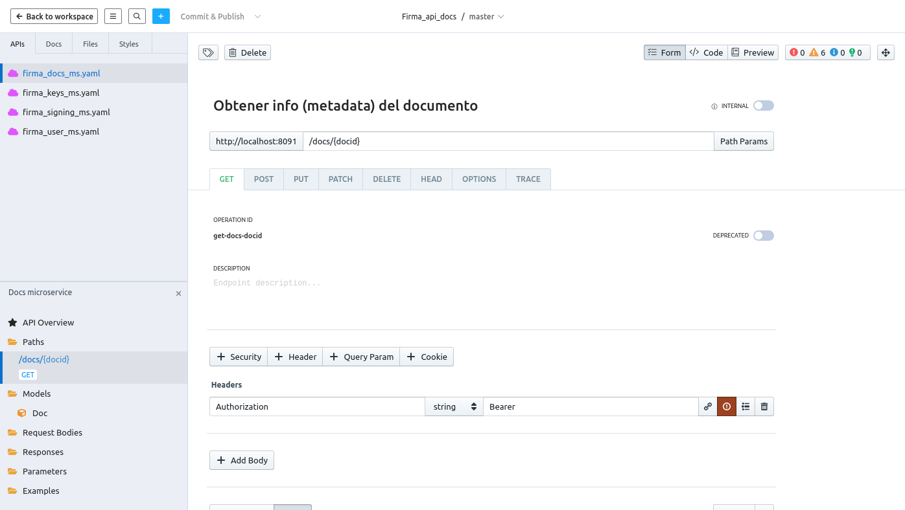

## OpenAPI

## Stoplight
Con Stoplight podemos tener diferentes espacios de trabajo o *workspaces* a los cuales se les asigna una URL, los cuales pueden ser personales o compartidos con hasta 3 usuarios de manera gratuita. Los documentos pueden almacenarse directamente en Stoplight pero también pueden sincronizarse con Repositorios como Github. Leer mas info en [Stoplight - Git Overview](https://meta.stoplight.io/docs/platform/e461fd1d846dc-git-overview).

Previamente hemos autorizado a Stoplight el acceso a la organización Github en [Third-party application access policy de **unal-swarch-2022i-1A**](https://github.com/organizations/unal-swarch-2022i-1A/settings/oauth_application_policy). Leer mas en [Acerca de las restricciones de acceso a App OAuth](https://docs.github.com/es/organizations/restricting-access-to-your-organizations-data/about-oauth-app-access-restrictions).

Al tener un limite de miembros de organización en el plan gratuito para trabajar de manera colaborativa necesitamos que cada uno de los 6 miembros del grupo cree su propio espacio de trabajo y enlace los documentos de especificación OpenAPI.

Para este tutorial vamos a abrir desde Stoplight los documentos OpenAPI alojados en https://github.com/unal-swarch-2022i-1A/firma_api_docs. 

1. Vamos a https://stoplight.io/free-sign-up e ingresamos nuestro correo, nombre de la organización o simplemente nuestro nombre si es personal y el subdominio de la URL de nuestro *workspace*
    

2. Confirmamos los datos del *workspace*

    

3. Confirmamos nuestro email

    

4. Abrimos nuestro espacio de trabajo y hacemos clic en `Start New Project`

    

5. Hacemos clic en `Add from Github` y luego en `Connect Github`

    

6. Damos clic en `Authorize`

    

7. Seleccionamos la organización *unal-swarch-2022i-1A*, el proyecto *firma_api_docs* y pulsamos `Add git project`

    

8. Ya están en el proyecto pulsamos `Edit`

    

9. En el menú del nombre superior medio `Firma_api_docs/Master` hacemos clic en  `Git pull` para siempre obtener los últimos cambios del repositorio

    

9. En el panel superior-izquierdo en la pestaña *APIs* seleccionamos uno de los documentos `.yaml` y luego en el panel inferior-izquierdo *API Overview* definimos los *paths* y *models* que se requieren

    

## Postman
Una de las limitantes de Postman es que por cuenta solo se puede pertenecer a un solo *team* (y subdomion de URL) [[?]](https://support.postman.com/hc/en-us/articles/115003330925-Can-I-join-multiple-teams-with-the-same-Postman-account-), por lo cual se necesario